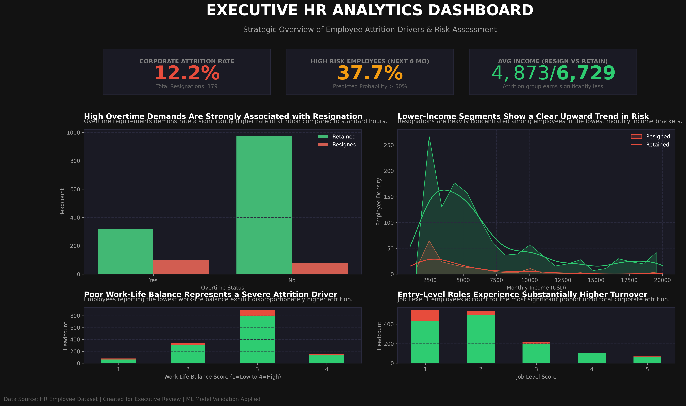

# Proyek Akhir: Menyelesaikan Permasalahan Human Resources

## Business Understanding

**PT Jaya Jaya Maju** adalah perusahaan multinasional yang telah berdiri sejak tahun 2000 dan memiliki lebih dari 1.000 karyawan yang tersebar di berbagai divisi. Seiring pertumbuhan bisnis yang pesat, perusahaan menghadapi tantangan serius di bidang **manajemen sumber daya manusia (SDM)**, yaitu tingginya tingkat **attrition** (keluar/resign) karyawan.

Tingginya attrition tidak hanya menimbulkan biaya rekrutmen dan pelatihan yang besar, tetapi juga berdampak pada **produktivitas tim**, **moral karyawan**, dan **kelangsungan operasional** perusahaan secara keseluruhan.

---

## Permasalahan Bisnis

Berdasarkan data HR internal, perusahaan mengidentifikasi sejumlah permasalahan kritis:

1. **Tingkat attrition melebihi 10%** — angka yang dianggap berbahaya bagi keberlangsungan operasional
2. **Kesulitan mengidentifikasi faktor penyebab** attrition secara sistematis dan berbasis data
3. **Tidak ada sistem peringatan dini** (early warning) untuk mendeteksi karyawan yang berisiko resign
4. **Keputusan HR masih bersifat reaktif**, bukan proaktif berdasarkan data

---

## Cakupan Proyek

Proyek ini mencakup tiga area utama:

| Area | Deskripsi |
|------|-----------|
| **Analisis Data** | Eksplorasi mendalam terhadap dataset HR untuk menemukan pola dan faktor penyebab attrition |
| **Business Dashboard** | Visualisasi interaktif KPI dan faktor attrition untuk mendukung keputusan manajemen |
| **Machine Learning** | Model prediksi attrition dengan performa tinggi (optimized via hyperparameter tuning) |

---

## Persiapan

**Sumber Data:**
```
https://raw.githubusercontent.com/dicodingacademy/dicoding_dataset/main/employee/employee_data.csv
```

**Setup Environment:**

1. Buat virtual environment:
python3 -m venv venv

2. Aktifkan virtual environment:
- Mac/Linux:
source venv/bin/activate

- Windows:
venv\Scripts\activate

3. Install dependencies:
pip install -r requirements.txt

```bash
# Clone atau buat direktori proyek
mkdir submission && cd submission

# Install dependencies
pip install -r requirements.txt
```

**requirements.txt:**
```
numpy
pandas
matplotlib
seaborn
scikit-learn==1.2.2
joblib==1.3.1
```

**Struktur Proyek:**
```
submission/
├── model/
│   └── model.pkl
├── notebook.ipynb
├── prediction.py
├── README.md
├── dashboard.png
└── requirements.txt
```

---

## Business Dashboard

Dashboard dibuat untuk memberikan gambaran menyeluruh kepada tim HR dan manajemen eksekutif tentang kondisi attrition di perusahaan.



### KPI Utama yang Ditampilkan:
| KPI | Nilai |
|-----|-------|
| **Total Karyawan** | ~1.400+ |
| **Jumlah Karyawan Keluar** | ~200+ |
| **Attrition Rate** | ~16.9% |

### Visualisasi dalam Dashboard:
1. **Attrition by Department** — Divisi mana yang paling banyak kehilangan karyawan
2. **Attrition by OverTime** — Perbandingan resign antara karyawan overtime vs tidak
3. **Attrition by Monthly Income** — Distribusi pendapatan karyawan yang resign vs bertahan
4. **Attrition by Job Level** — Level jabatan dengan tingkat resign tertinggi
5. **Attrition by Work-Life Balance** — Korelasi kepuasan WLB dengan keputusan resign

## Insight Bisnis

Karyawan dengan lembur tinggi memiliki risiko attrition yang jauh lebih besar, mengindikasikan adanya ketidakseimbangan beban kerja.
Work-life balance yang rendah merupakan prediktor kuat terhadap pengunduran diri dan perlu segera ditangani melalui kebijakan HR.
Karyawan pada level jabatan yang lebih rendah cenderung lebih sering keluar, mengindikasikan adanya kekhawatiran terkait pengembangan karir.
Karyawan berpenghasilan rendah menunjukkan kecenderungan attrition yang lebih tinggi dibandingkan kelompok berpenghasilan lebih tinggi.

## Validasi Insight Berbasis Model
Temuan-temuan yang disajikan dalam dashboard ini sepenuhnya berbasis bukti empiris. Variabel-variabel yang ditampilkan — OverTime, MonthlyIncome, JobLevel, dan WorkLifeBalance — secara eksplisit merupakan prediktor dengan kontribusi tertinggi terhadap attrition berdasarkan analisis feature importance model Random Forest. Hal ini memastikan bahwa seluruh keputusan eksekutif yang diambil selanjutnya menarget akar permasalahan yang telah terbukti secara statistik, bukan sekadar korelasi observasional semata.
Definisi Karyawan Berisiko Tinggi
KPI "High Risk Employee (%)" menyediakan metrik peringatan dini yang dapat ditindaklanjuti oleh tim HR.

## Definisi: Seorang karyawan dikategorikan sebagai "Berisiko Tinggi" apabila probabilitas prediksi attrition-nya melebihi ambang batas 0,5 (50%).
Justifikasi Threshold: Batas keputusan 0,5 dipilih untuk mencapai keseimbangan optimal antara precision dan recall, memastikan intervensi HR menjangkau karyawan yang benar-benar berpotensi resign tanpa menghasilkan terlalu banyak false alarm.
Mekanisme: Metrik ini diturunkan langsung dari fungsi predict_proba() model, yang mengisolasi skor keyakinan untuk kelas attrition berdasarkan profil unik masing-masing karyawan.
Nilai Bisnis: Hal ini mentransformasi kebijakan HR dari reaktif menjadi proaktif, memungkinkan strategi retensi yang tepat sasaran bagi kelompok karyawan paling rentan sebelum pengunduran diri terjadi.
---

## Menjalankan Prediksi

Setelah model dilatih dan disimpan (melalui `notebook.ipynb`), gunakan script berikut untuk melakukan prediksi:

```bash
python prediction.py
```

Script ini akan memuat `model/model.pkl` dan menghasilkan prediksi attrition untuk contoh data karyawan.

---

## Conclusion

Berdasarkan analisis menyeluruh terhadap dataset HR PT Jaya Jaya Maju, ditemukan bahwa **attrition karyawan dipicu oleh beberapa faktor kunci yang saling berinteraksi**:

1. **OverTime** adalah prediktor terkuat — karyawan yang bekerja overtime secara reguler memiliki risiko resign jauh lebih tinggi
2. **Monthly Income rendah** menjadi faktor pendorong utama karyawan level bawah untuk mencari peluang di tempat lain
3. **Job Level rendah** (entry-level) menandakan minimnya jalur karier yang jelas
4. **Work-Life Balance buruk** menurunkan kepuasan kerja dan meningkatkan kemungkinan resign
5. **Distance From Home jauh** berkorelasi dengan kelelahan komuter yang berujung pada turnover

Model Random Forest yang telah dituning menghasilkan nilai AUC sebesar 0.7884. 
Meskipun performanya cukup baik, Logistic Regression menunjukkan performa yang lebih stabil dan unggul secara keseluruhan dalam evaluasi model.

Oleh karena itu, Logistic Regression dipilih sebagai model terbaik dalam proyek ini.

---

## Rekomendasi Action Items

Berdasarkan temuan analisis, berikut adalah rekomendasi strategis untuk tim HR PT Jaya Jaya Maju:

### 🔴 Prioritas Tinggi (Segera Dilaksanakan)
1. **Batasi Overtime** — Terapkan kebijakan pembatasan jam lembur maksimal 2x/minggu dan berikan kompensasi yang adil
2. **Evaluasi & Sesuaikan Gaji Entry-Level** — Lakukan benchmarking salary untuk posisi Job Level 1 & 2 agar kompetitif di pasar

### 🟡 Prioritas Menengah (1-3 Bulan)
3. **Program Work-Life Balance** — Implementasikan flexible working hours, remote work option, dan wellness program
4. **Jalur Karier yang Jelas** — Buat Individual Development Plan (IDP) dan program mentoring untuk karyawan junior
5. **Fasilitas Commuting** — Sediakan shuttle bus, subsidi transportasi, atau opsi remote work bagi karyawan dengan jarak rumah > 20 km

### 🟢 Prioritas Jangka Panjang (3-12 Bulan)
6. **Sistem Early Warning Berbasis ML** — Deploy model prediksi ini ke dashboard HR untuk monitoring real-time karyawan berisiko
7. **Exit Interview Terstruktur** — Kumpulkan data kualitatif untuk memperkaya model prediksi
8. **Program Employee Engagement** — Survey kepuasan berkala (quarterly) dan tindak lanjut yang terukur

---

*Proyek ini dibuat sebagai submission Dicoding — Belajar Penerapan Data Science | © 2026*
